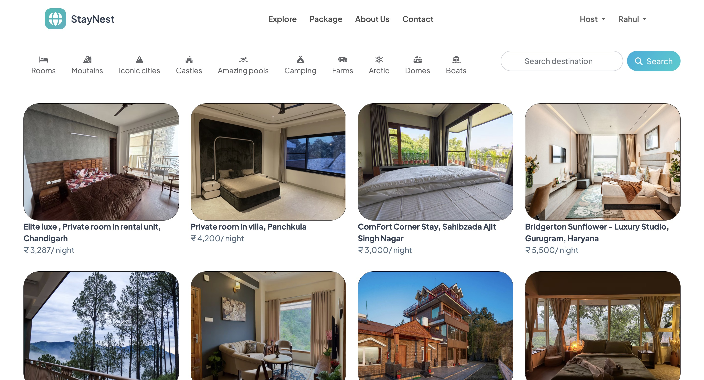
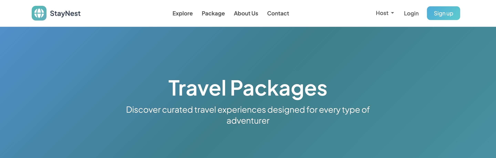
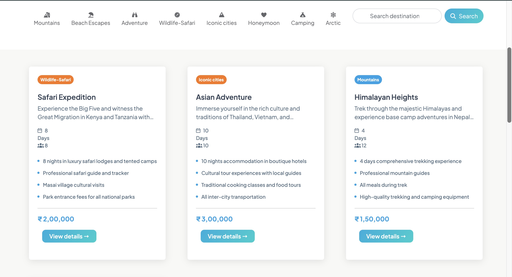
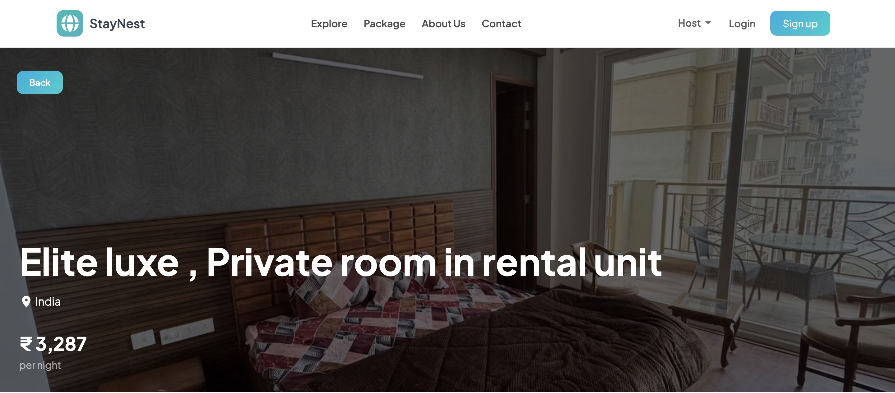
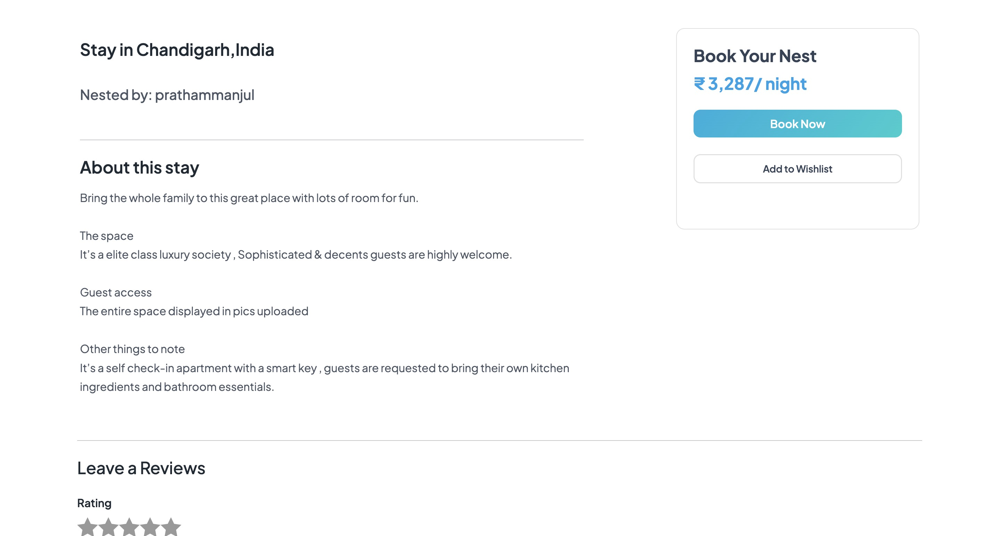
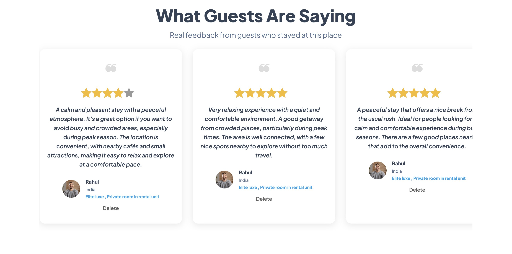
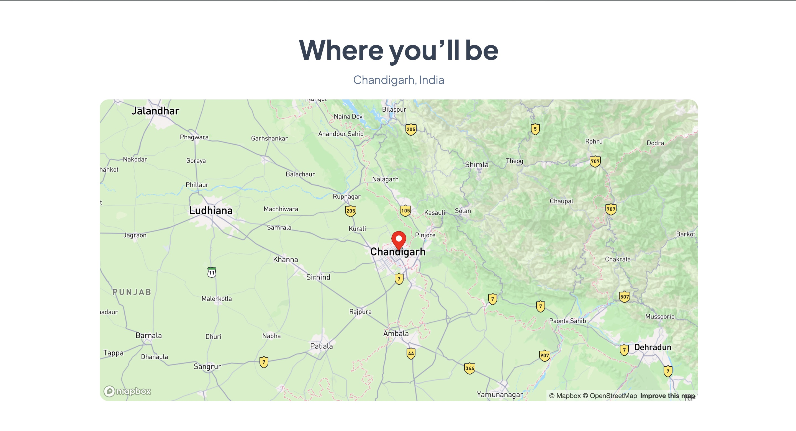
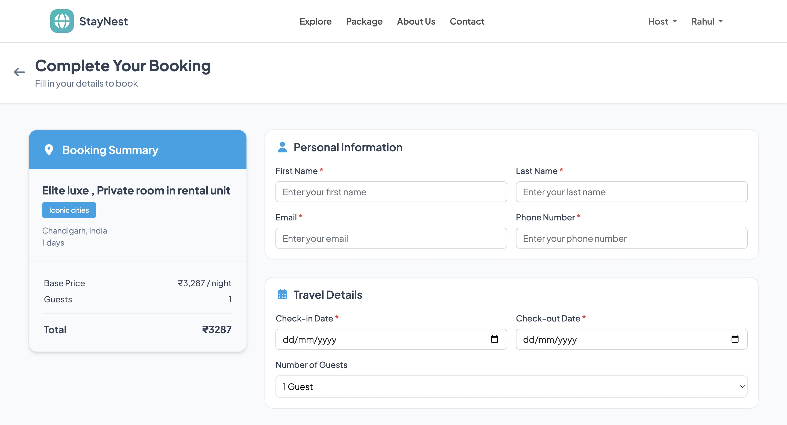
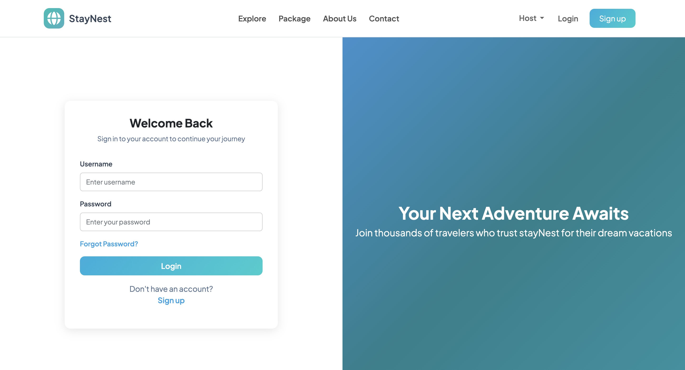

# stayNest

stayNest is a full-stack web application for listing, reviewing, and booking properties and travel packages.
Unlike traditional property-only booking platforms, stayNest also provides an integrated travel package booking system, allowing users to explore accommodation and travel options on a single platform. The project is built using real-world business rules, secure authentication, and a scalable MVC architecture.

## Live Deployment

Deployed Application:
https://staynest-property-and-travel-package.onrender.com

Note:

- The application may take some time to load initially due to server cold start.
- If a "Page Not Found" screen appears on first load, do not refresh repeatedly.
  Simply click on the **Explore** option to continue.

Device Compatibility:

- Currently optimized for desktop (PC) usage only.
- The application is not fully responsive for different screen sizes and mobile devices at this stage.

## Features

### Authentication & Authorization

- User signup, login, and logout
- Session-based authentication
- Protected routes for reviews and bookings
- Users must be logged in to book or post reviews

### Listings & Travel Packages

- Create, edit, and delete property listings
- Browse travel packages with detailed itineraries
- Image upload support for listings
- Clean and responsive user interface

### Reviews

- Only authenticated users can add reviews
- Only the author of a review can delete it
- Listing owners cannot review their own listings
- Flash messages for user feedback

### Booking System

- Book properties for selected date ranges
- Booking overlap prevention to avoid double bookings
- Availability validation before booking confirmation
- Only logged-in users can book

### Search & Filters

- Searching and filtering for listings and packages
- Filter by location, country, and category

### Maps & Location (Mapbox)

- Interactive maps integrated using Mapbox
- Display property locations visually on the map
- Improved location-based discovery for users

### Screenshots

### Home / Listings Page

### Package Page

### Listing Details Page

### Booking Flow

### Authentication

## Tech Stack

### Frontend

- HTML5
- CSS3
- Bootstrap
- EJS

### Backend

- Node.js
- Express.js

### Database

- MongoDB
- MongoDB Atlas

### Authentication & Security

- Passport.js
- Express-Session
- Connect-Mongo

### Maps & Geolocation

- Mapbox API

### Other Tools

- Mongoose
- Multer (image uploads)
- Flash messages
- MVC architecture

## Project Structure

stayNest/
├── models/
├── controllers/
├── routes/
├── views/
├── public/
├── utils/
└── app.js

## Deployment

- Application deployed using Render
- MongoDB Atlas used as a cloud-hosted database
- Environment variables used for secure configuration

## Environment Variables

Create a .env file and add:

- MONGO_URI=your_mongodb_atlas_url,
- SESSION_SECRET=your_session_secret,
- CLOUDINARY_CLOUD_NAME=your_cloud_name,
- CLOUDINARY_API_KEY=your_api_key,
- CLOUDINARY_API_SECRET=your_api_secret,
- MAPBOX_TOKEN=your_mapbox_access_token

## Running the Project Locally

- git clone https://github.com/prathammanjul/staynest-property-travel-package-booking
- cd stayNest
- npm install
- npm start

Open the application in your browser:

http://localhost:8080/listings

## Future Enhancements

- Admin dashboard
- Booking history and invoice generation
- Wishlist functionality
- Advanced search and smart filters
- Multiple image upload support for listings and travel packages
  (Currently, only one image can be uploaded per listing/package)
- Personalized travel package customization based on user preferences such as dates, destinations, and budget
- Payment gateway integration
- Full responsiveness for mobile and tablet devices

## Author

Pratham Manjul
